# SRMSS — User Manual

**Smart Route Management Software System (SRMSS)** is a web application for running a bus
depot: managing the fleet of vehicles, the drivers who operate them, the routes and their
stops, the timetables (schedules) that put a driver and vehicle on a route, and the day-to-day
trips that result. It also records fuel and maintenance, produces operational reports, and
keeps an audit trail of every change.

This manual walks through each screen of the system. The screenshots are taken from the live
application and are stored in the `docs/ui/` folder alongside this document.

---

## 1. Roles and access

SRMSS uses **role-based access control (RBAC)**. Every account is given exactly one role, and
each role unlocks a specific set of screens and actions. Accounts are created by staff inside
the application — there is no public self-registration.

| Capability | Admin | Supervisor | Operator | Driver |
|---|:---:|:---:|:---:|:---:|
| Dashboard & reports | ✅ | ✅ | ✅ | — |
| Manage vehicles & drivers (fleet) | ✅ | ✅ | — | — |
| Manage routes & stops | ✅ | ✅ | — | — |
| Manage schedules | ✅ | ✅ | — | — |
| Log fuel & maintenance | ✅ | ✅ | ✅ | — |
| View the trips board | ✅ | ✅ | ✅ | — |
| Set any trip status (incl. cancel) | ✅ | ✅ | — | — |
| Approve / reject a driver's status request | ✅ | ✅ | ✅ | — |
| Manage users & roles | ✅ | — | — | — |
| View the audit log | ✅ | — | — | — |
| View own trips & request a status change | ✅* | — | — | ✅ |
| Change appearance (theme) | ✅ | ✅ | ✅ | ✅ |

\* The admin role technically holds every permission; in normal use the *driver* role is the
one that works from the **My Trips** screen.

---

## 2. Logging in

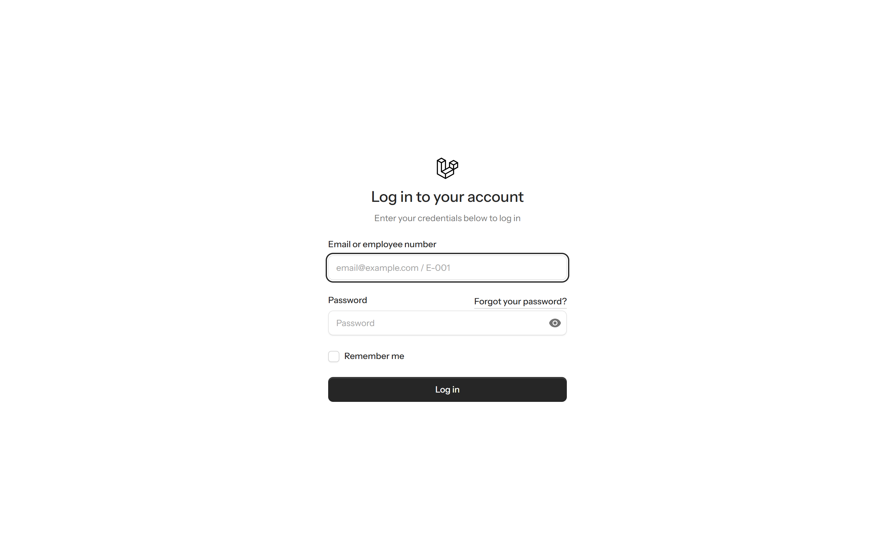

1. Open the application URL in a web browser.
2. In **Email or employee number**, enter:
   - your **email address** if you are a staff member (admin, supervisor, operator), or
   - your **employee number** (for example `E-001`) if you are a driver.
3. Enter your **password**.
4. (Optional) Tick **Remember me** to stay signed in on this device.
5. Click **Log in**.

If you have forgotten your password, click **Forgot your password?** to request a reset link by
email. After signing in, staff land on the **Dashboard** and drivers land on **My Trips**.

---

## 3. Staff guide

The left-hand sidebar is your main navigation. It is grouped into **Platform** (Dashboard,
Reports), **Operations** (Vehicles, Drivers, Routes, Schedules, Trips, Fuel Logs, Maintenance)
and **Administration** (Users, Activity Log). You only see the items your role allows.

### 3.1 Dashboard

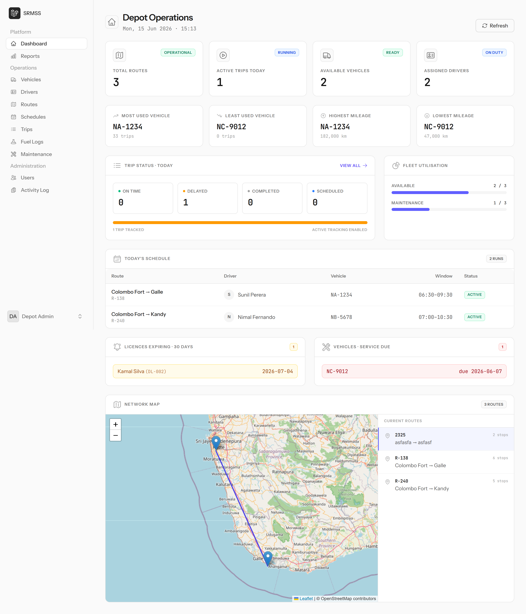

The Dashboard is the depot's at-a-glance overview. It shows:

- **Headline figures** — total routes, active trips today, available vehicles, assigned drivers.
- **Fleet highlights** — most- and least-used vehicle, highest and lowest mileage.
- **Trip status today** and **fleet utilisation** (available vs. in maintenance).
- **Today's schedule** — the runs planned for the current day.
- **Alerts** — drivers whose licence expires within 30 days, and vehicles that are due a service.
- **Network map** — an interactive map (powered by Leaflet/OpenStreetMap) plotting the routes
  and their stops.

The Dashboard is read-only; use the sidebar to act on anything it surfaces.

### 3.2 Vehicles

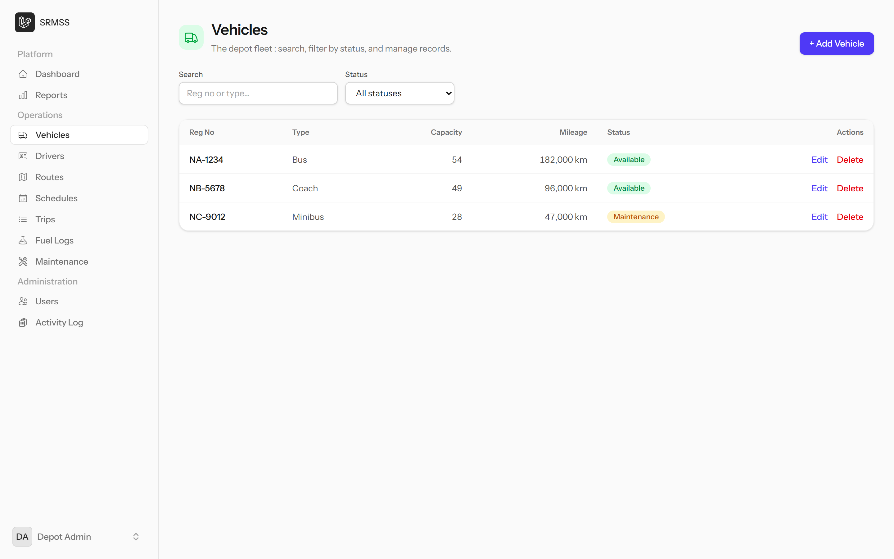

Maintain the fleet of vehicles.

1. Click **+ Add Vehicle** to register a new vehicle.
2. Fill in the registration number, type (bus / coach / minibus), brand, model, fuel type,
   seating capacity and current mileage, then **Save**.
3. Use the row actions to **edit** or **remove** a vehicle.
4. A vehicle whose latest service is overdue is flagged as **service due**.

### 3.3 Drivers

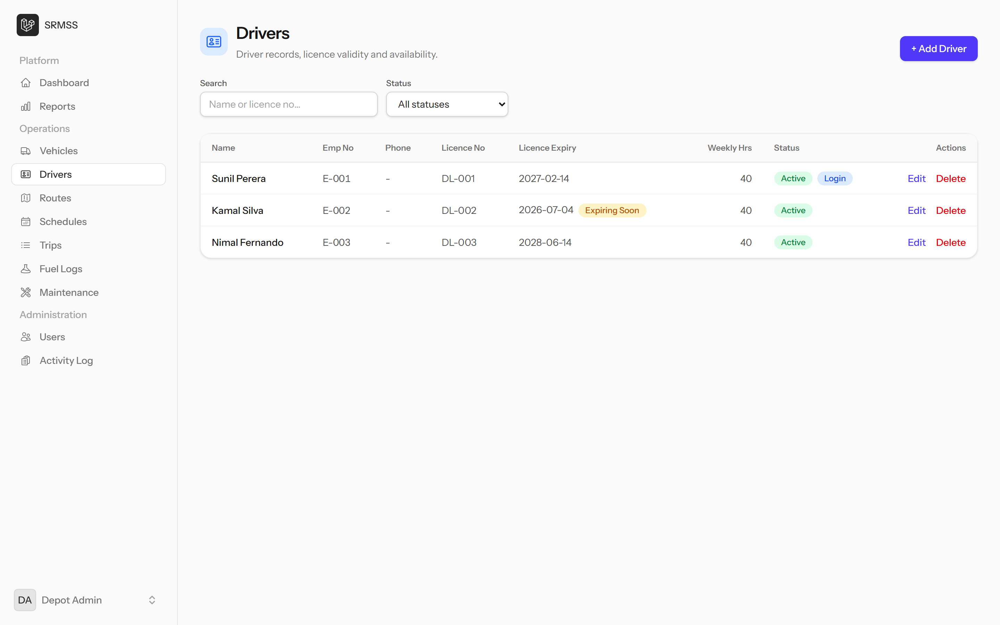

Maintain driver records.

1. Click **+ Add Driver** and enter the driver's details: name, NIC, phone, email, address,
   licence number, licence expiry and weekly hours. The **employee number** (e.g. `E-001`) is
   assigned automatically.
2. Tick **This driver needs a login** to give the driver an account; they will sign in with
   their employee number and the password you set.
3. Drivers whose licence expires soon are highlighted so renewals are not missed.

### 3.4 Routes and stops

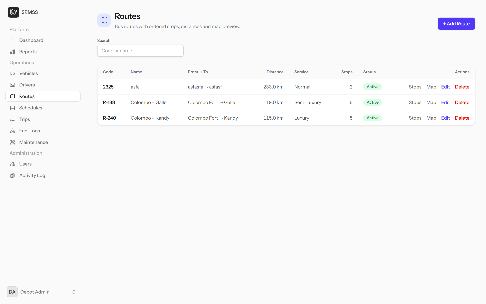

Define the routes the depot serves.

1. Click **+ Add Route** and enter the code, name, start and end points, total distance and
   service type.
2. Add the **stops** in order — each stop has a name and map coordinates, and the sequence
   determines the order along the route.
3. Click **Map** on any route to view it on an interactive map:

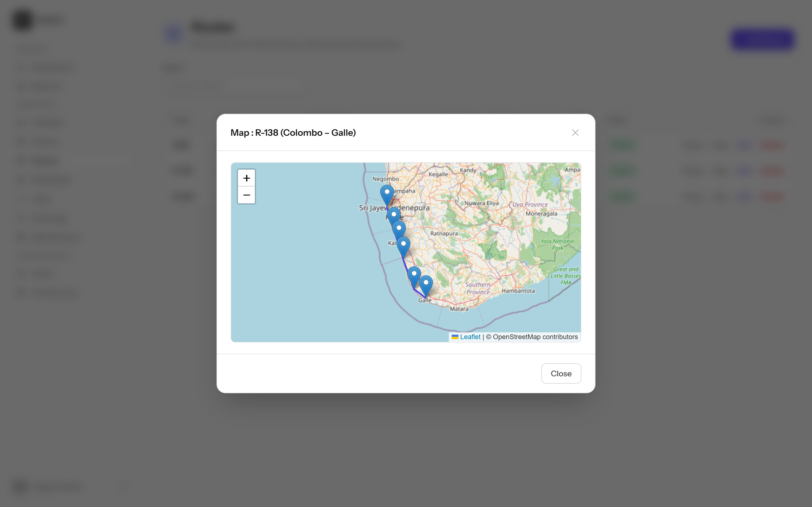

The map plots every stop in sequence and draws the line of the route, so you can visually
confirm the stops are in the right order.

### 3.5 Schedules

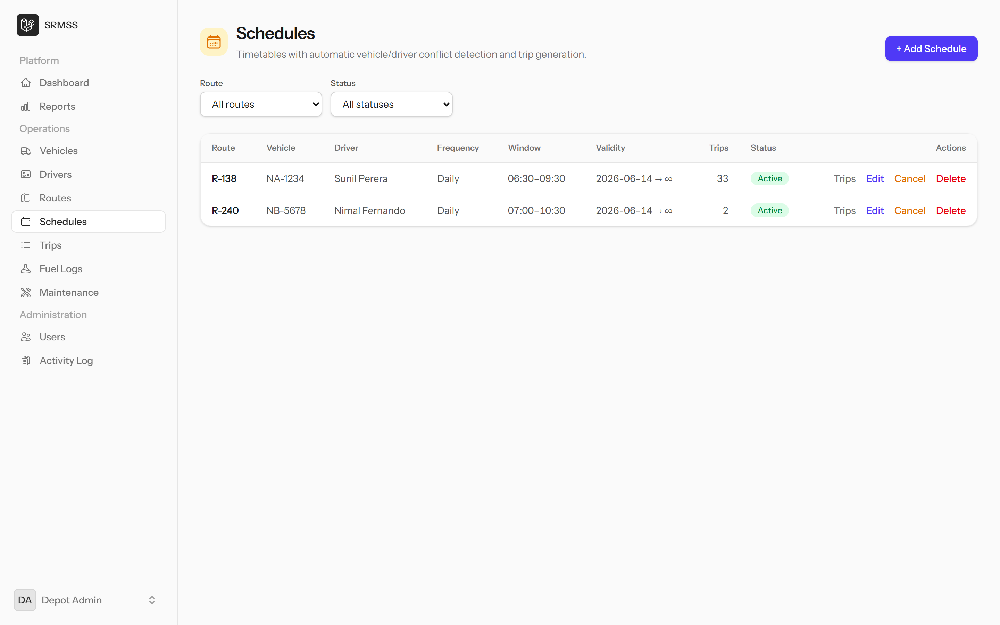

A schedule is a recurring timetable that assigns a **route**, a **vehicle** and a **driver**.

1. Click **+ Add Schedule**.
2. Choose the route, vehicle and driver, set the frequency (e.g. daily), the departure and
   arrival times, and the validity dates.
3. **Save**. The system checks for clashes so the same vehicle or driver is not double-booked
   at the same time.

### 3.6 Trips

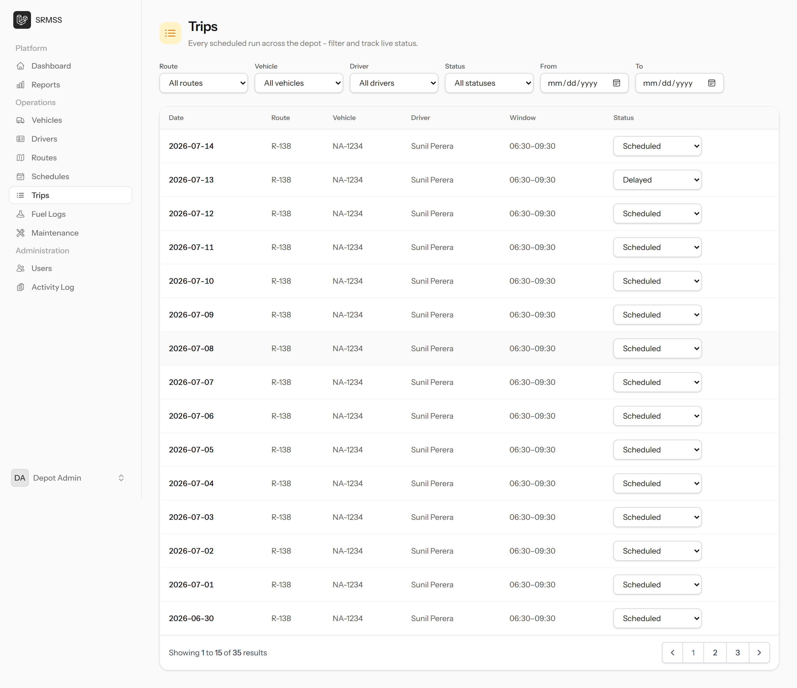

The Trips board is the live record of individual runs generated from the schedules.

1. Use the filters (route, vehicle, driver, status, date range) to find trips.
2. Each trip has a status: *scheduled, on time, delayed, completed* or *cancelled*.
3. Supervisors and admins can change a trip's status directly from the status control.
4. When a driver requests a status change, it appears here as **pending approval** — an
   operator, supervisor or admin can **approve** or **reject** it.

### 3.7 Fuel logs

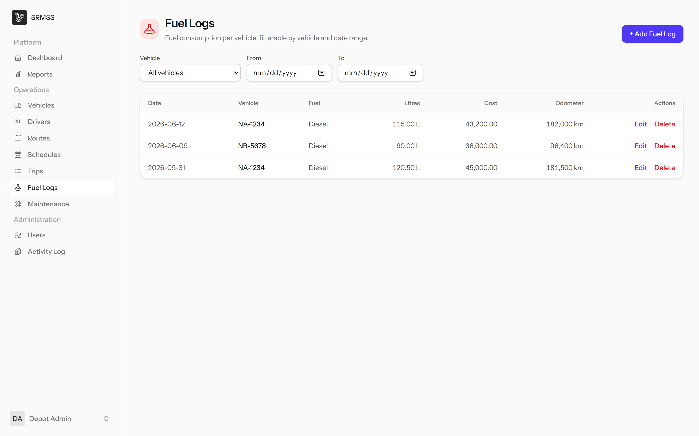

Record each refuelling.

1. Click **+ Add Fuel Log**, choose the vehicle, and enter the litres, cost, odometer reading
   and date.
2. **Save**. These entries feed the fuel-consumption figures in Reports.

### 3.8 Maintenance logs

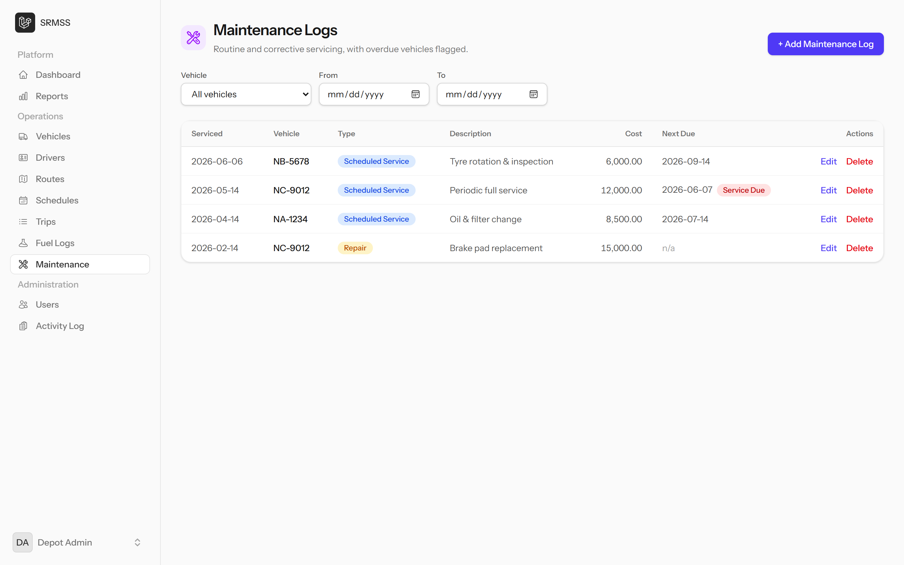

Record servicing and repairs.

1. Click **+ Add Maintenance Log**, choose the vehicle, set the type (routine or corrective),
   describe the work, and enter the cost and the date serviced.
2. Optionally set a **next service due** date — when that date passes, the vehicle is flagged as
   *service due* on the Dashboard and Vehicles screens.

### 3.9 Reports and analytics

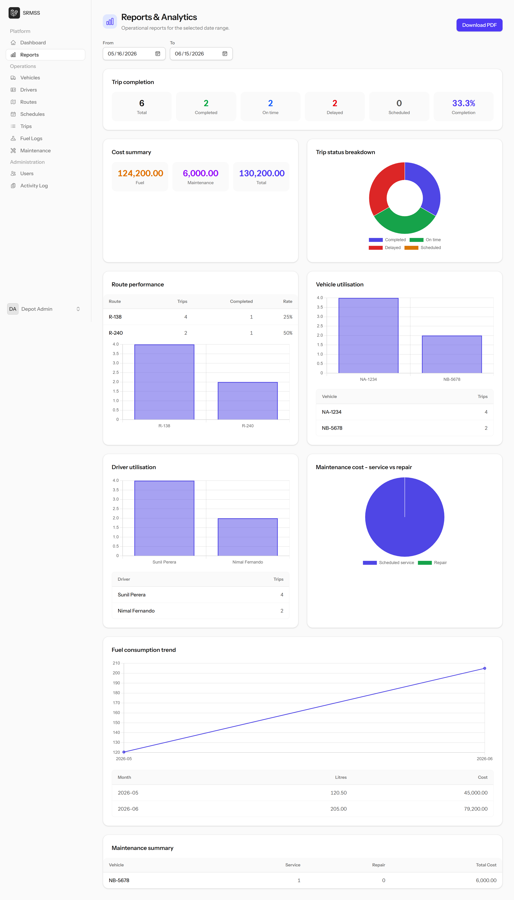

Operational reporting over a date range you choose.

1. Set the **From** and **To** dates at the top.
2. Review the panels: trip-completion summary, cost summary (fuel / maintenance / total), trip
   status breakdown, route / vehicle / driver utilisation, maintenance cost (service vs. repair),
   and the fuel-consumption trend.
3. Click **Download PDF** to export the current report for printing or sharing.

### 3.10 Users and roles *(admin only)*

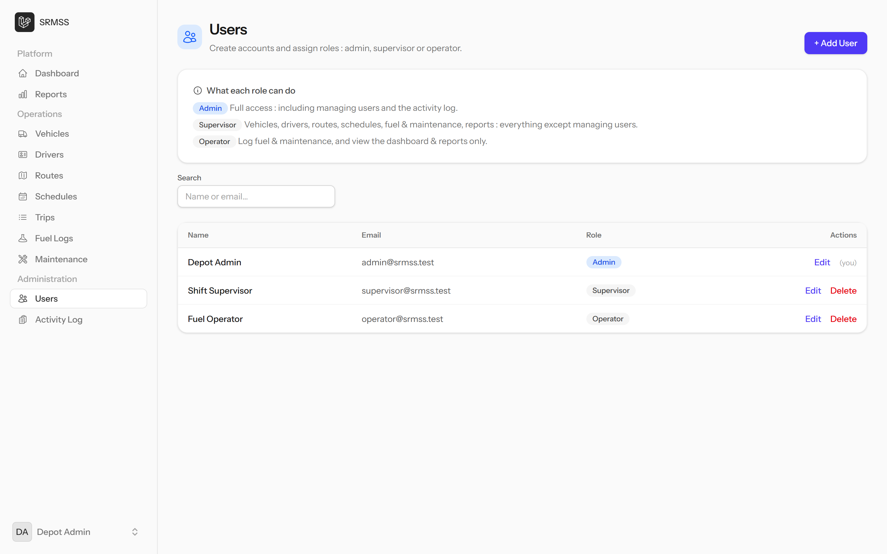

1. Click **+ Add User**, enter the name, email and password, and assign a **role**.
2. The role determines exactly what that user can see and do (see Section 1).
3. Existing users can be edited or removed.

### 3.11 Activity log *(admin only)*

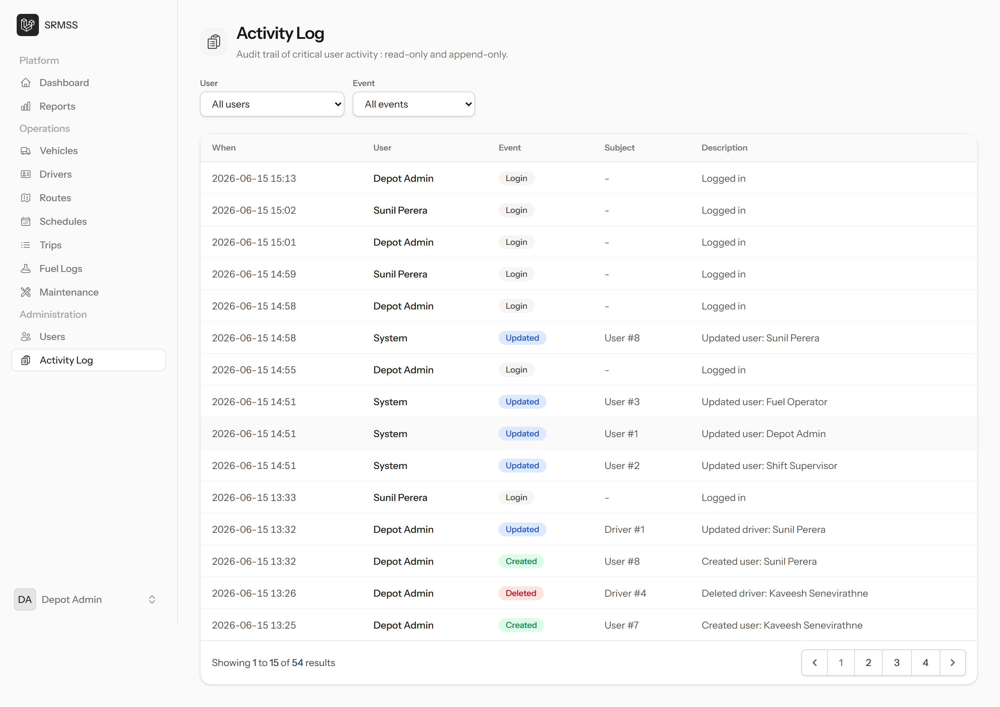

A read-only **audit trail**. Every significant action — logins, and the creation, update or
deletion of records — is recorded here with the user, the event, the affected record and a
timestamp. Entries cannot be edited or deleted, so the log remains a trustworthy history.

---

## 4. Account settings

Open the account menu (your name, bottom-left of the sidebar) and choose **Settings**.

### 4.1 Profile

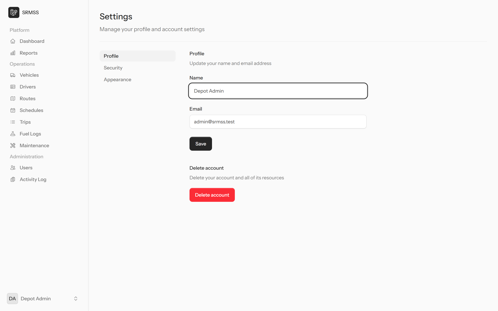

Update your display name and email address. Changing your email may require you to verify the
new address. *(Drivers do not have a profile page — their details are managed for them on the
Drivers screen.)*

### 4.2 Appearance

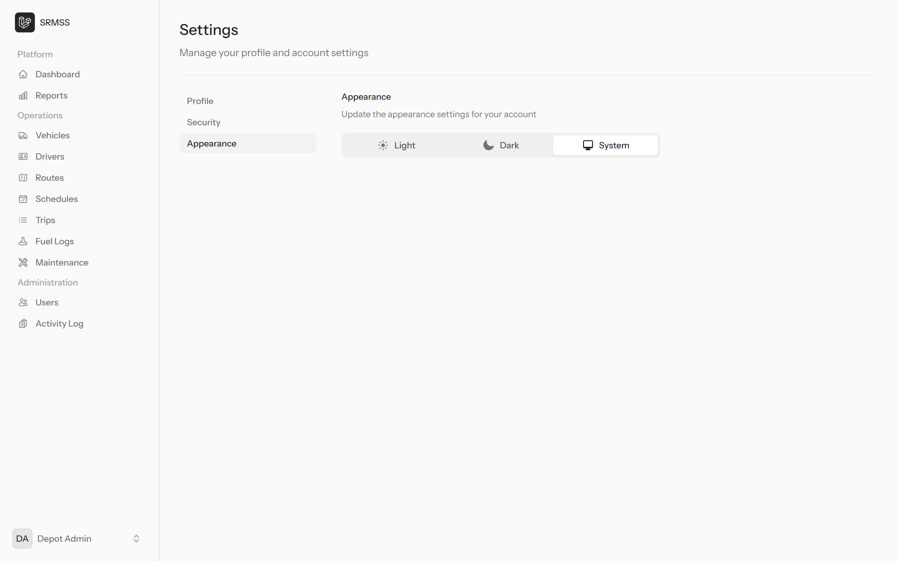

Switch between **light**, **dark** and **system** themes. Available to everyone, drivers included.

### 4.3 Security

Security settings sit behind a confirmation step. The first time you open them in a session you
are asked to confirm your password:

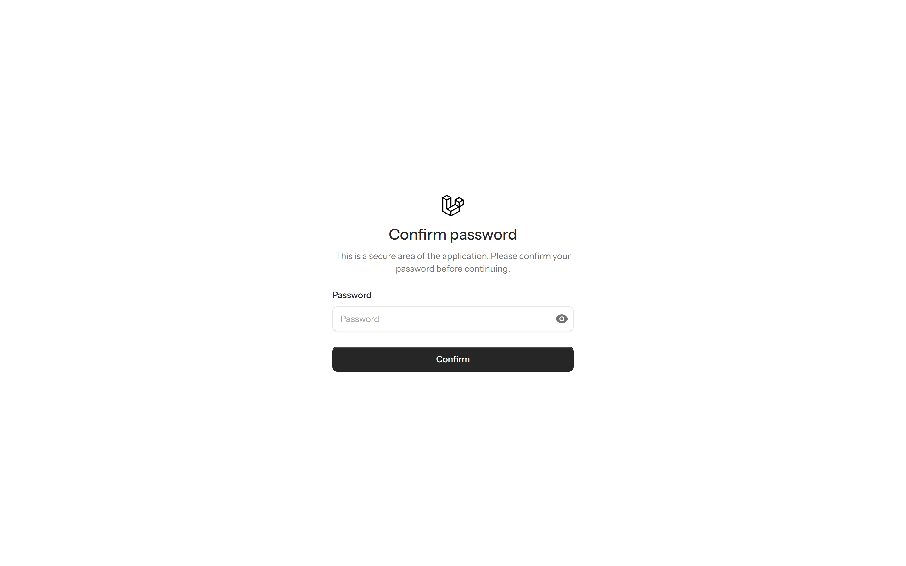

After confirming, you can change your password:

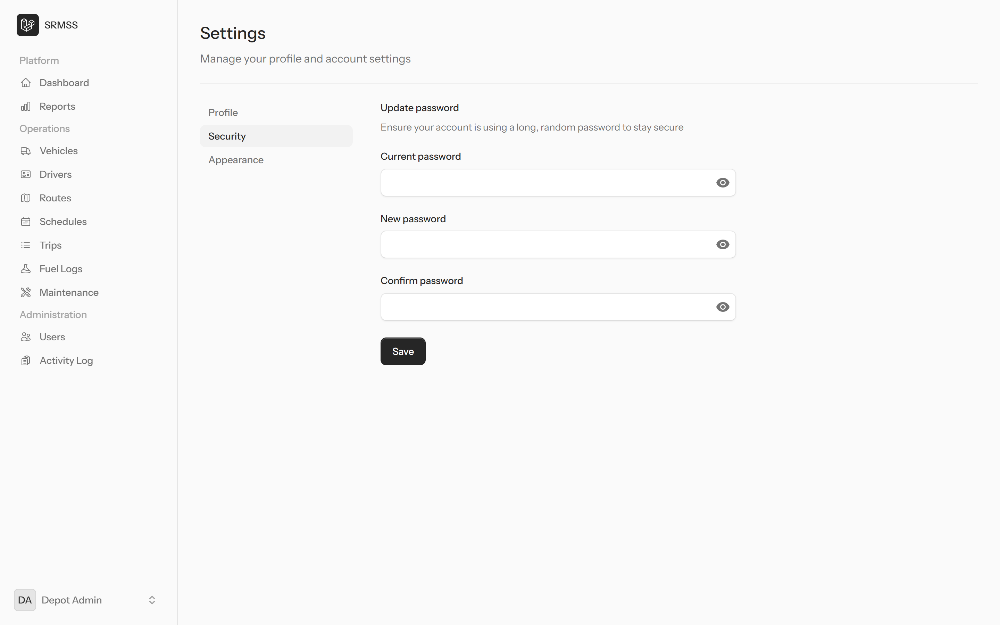

1. Enter your **current password**.
2. Enter and confirm a **new password**.
3. Click **Save**.

---

## 5. Driver guide

Drivers have a deliberately simple view with a single screen — **My Trips** — plus appearance
settings.

### 5.1 My Trips

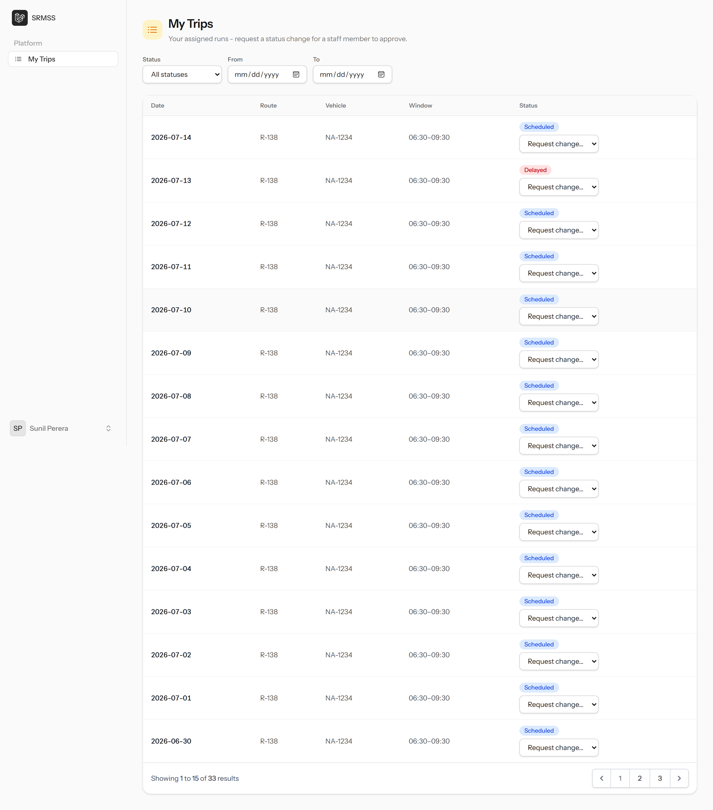

This lists only the trips assigned to you.

1. Use the status and date filters to find a run.
2. To report progress, open the **Request change…** control on a trip and choose the new status
   (*on time, delayed* or *completed*).
3. Your request is sent to staff for approval — it becomes the trip's status only once an
   operator, supervisor or admin approves it. Drivers cannot cancel a trip.

### 5.2 Appearance

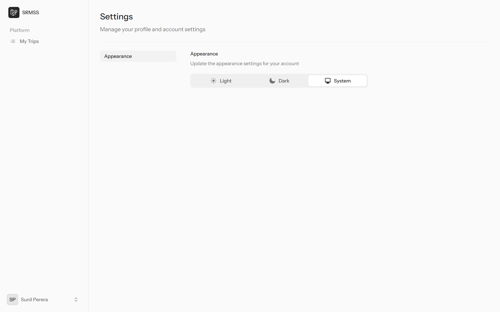

Drivers can switch between light, dark and system themes from their settings.

---

## 6. Quick troubleshooting

| Symptom | What to check |
|---|---|
| "These credentials do not match" on login | Staff use **email**; drivers use **employee number** (`E-001`). Check the password and caps lock. |
| Locked out after several attempts | Login is rate-limited; wait a minute and try again. |
| A screen is missing from the sidebar | Your role does not include it — ask an administrator (see Section 1). |
| A driver cannot change a trip status directly | By design — drivers *request* a change; staff approve it on the Trips board. |
| The route/network map is blank | The map loads tiles from the internet; check the connection. |
